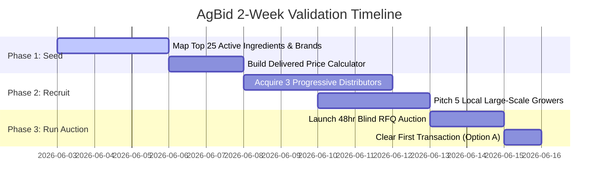

# Paul Graham-Style Brutal Pressure Test: AgBid

This document runs your specific grower-facing input bidding concept through the adversarial, cynical, and brutally honest lens of an early-stage startup incubator. We analyze the exact mechanics you provided: the CDMS data engine, the "must-pick" commitment barrier, advertising monetization, adjuvant bundling, and the clearinghouse choice.

---

## Verdict: Proceed with Narrowing

**AgBid is a highly compelling, multi-million dollar business disguised as a boring marketplace, but it is currently structured in a way that would kill it in 30 days due to freight logistics, coop credit lock-in, and distributor retaliation.** You must narrow the wedge to the top 20 active ingredients (e.g., Glyphosate, Glufosinate, Dicamba, Clethodim) and launch strictly as a clearinghouse (Option A) to survive.

---

## Scorecard

| Area | Score | Rationale |
| :--- | :---: | :--- |
| **Pain Intensity** | **5/5** | Outstanding. Input costs are the single largest variable cash drain for a grower. Saving 10-15% on a $300,000 annual chemical bill is the difference between profitability and foreclosure. |
| **Buyer Clarity** | **4/5** | Very high. The buyer is the progressive commercial grower (farming 2,000+ acres) who is already comfortable using digital spreadsheets and modern farm management software. |
| **Urgency** | **4/5** | Seasonal spike. Extremely urgent during pre-pay season (November–January) and in-season outbreak emergencies (spraying windows open for only 5–7 days). |
| **Differentiation** | **5/5** | Absolute. Mapping CDMS/Agrian active ingredients to force generic-vs-brand price parity breaks the coops' greatest defensive shield: obfuscating generic equivalents. |
| **Speed to Validate** | **3/5** | Medium. You cannot validate this with a simple landing page because you need at least three local distributors signed up who are willing to bid. |
| **Founder Advantage** | **?/5** | Depends on your access to ag-distribution relationships. Without them, distributors will blacklist you instantly for "market degradation." |
| **Distribution Advantage** | **2/5** | Difficult. Growers are highly relationship-bound to their local coop agronomists. Breaking this trusted advisory loop is highly resistant. |
| **Why Now?** | **5/5** | **Consolidation & Gen-Shift:** Major chemical manufacturers (Bayer, Corteva, Syngenta) have consolidated, reducing retail options. Furthermore, generational transfer is putting farms in the hands of younger, tech-native growers who hate opacity. |

---

## Core Assumption

**Growers are willing to risk their trusted personal relationship with their local coop agronomist to save 12% on input costs, and distributors will bid against each other on a public platform without experiencing cartel-like pricing collusion.**

---

## Why This Could Still Work

1. **Active Ingredient Arbitrage:** Chemical brand opacity is a massive tax on farmers. A farmer requesting "Roundup PowerMAX 3" gets quoted $48/gallon. If your platform shows them that a generic Glyphosate 5.4 lb active ingredient equivalent is bidding at $32/gallon, they will switch instantly.
2. **Adjuvant Profit Capture:** Retailers make almost zero margin on generic bulk chemicals (like glyphosate), but make **50–80% margins on proprietary adjuvants and nutritionals** (surfactants, drift agents). Letting distributors bundle their high-margin adjuvants to subsidize the base chemical price is a genius stroke of agricultural economics.

---

## Fatal Flaws & Blindspots

| Risk | Severity | Why It Matters | Fast Test |
| :--- | :---: | :--- | :--- |
| **The Coop Credit Lock-in** | **CRITICAL** | 80% of farmers do not pay cash for chemicals upfront; they buy on credit from their local coop, secured by their crop harvest (crop-lien financing). If AgBid requires immediate cash payments, **90% of your market is instantly locked out.** | Pitch the concept to 5 large growers and ask: *"If I save you 15% but you have to pay cash upfront instead of using your coop credit line, can you buy?"* |
| **Freight & IBC Tote Logistics** | **HIGH** | Agricultural chemicals are shipped in massive 250-gallon IBC totes weighing 2,500 lbs. They are classified as hazmat and require specialized flatbed delivery. A cheap bid from a distributor 300 miles away is useless if the freight cost is $2,000. | Build a manual freight calculator into the bidding engine. Bids must be submitted as **"delivered price"** including Hazmat freight. |
| **Distributor Cartelization** | **HIGH** | The distribution network is small (few major players like Tenkoz, Loveland, Nutrien). If they see each other's bids or realize they are bidding on the same farmer's RFQ, they will collude to submit identical list-price bids to protect the retail channel from "degradation." | Bids must be **completely blind**. Distributors must never see other active bids or the identity of competing bidders. |

---

## Problem Reality

* **Pain:** Oppressive input cost opacity. Coops charge different prices to neighboring farmers based on relationship strength and volume.
* **Early Adopter:** Large-scale commercial row-crop growers (corn, soybeans, wheat) farming 3,000+ acres who buy in bulk truckloads.
* **Painkiller or Vitamin:** Absolute **painkiller**. Input costs determine farm survival.
* **Trigger Moment:** The post-harvest planning phase (October–December) when growers sit down to write their chemical pre-pay checks for the next year.
* **Existing Workaround:** Driving to three different coops, collecting manual paper quotes, and playing them off one another via text message.

---

## The Clearinghouse Decision: Option A is the Only Way

If you choose **Option B (Direct Hand-off / Disconnected)**, your business will die in three months. 
* **The Leakage Death Spiral:** Farmers and distributors are highly local. Once a grower finds a distributor who bids 15% lower on AgBid, they will take the transaction offline next month to avoid AgBid's transaction fee.
* **Channel Retaliation:** Major chemical manufacturers (like Corteva or Bayer) will sue or cut off distributors who sell below MSRP on a public platform. Under **Option A (Clearinghouse)**, AgBid acts as the Merchant of Record. The distributor bills AgBid, and AgBid bills the farmer. The manufacturer never sees the distributor selling directly to the farmer at a discount, protecting the distributor's wholesale license.

---

## CDMS / Agrian Scraper Strategy (Data Engine)

Scraping all 100,000+ labels on Day 1 is an expensive distraction. CDMS and Agrian have active scraping countermeasures (IP blocks, CAPTCHAs, legal terms).

### The Smart Wedge Approach:
1. **Do not scrape the ocean.** 90% of chemical volume is represented by the **top 25 active ingredients** (Glyphosate, Glufosinate, Atrazine, 2,4-D, Dicamba, Clethodim, Metolachlor, Mesotrione, Azoxystrobin, Pyraclostrobin, Bifenthrin, etc.).
2. Seed the database with just these 25 active ingredients and manually map the corresponding 150 brand-name products. This covers **80% of all grower transactions** for your MVP.
3. Once validated, write a localized parser script using `BeautifulSoup` or `Selenium` to fetch CDMS label PDFs on-demand when a grower requests a rare product that isn't in your seeded database.

---

## The 2-Week MVP Plan

* **What to Build:** A single-page, blind bidding portal using a simple form. Seed it manually with your mapped active ingredients.
* **What to Cut:** Scraping CDMS/Agrian entirely, automatic credit checks, mobile apps, automated payment gateways. Clear payments manually via wire transfer or cashier's check for the MVP.
* **The 2-Week Test:** Get **one grower** to submit a real RFQ for pre-pay chemicals, get **three distributors** to bid blindly, enforce the "Must Pick" rule, and clear the transaction manually through AgBid as the broker of record.

---

## Kill Test

**The AgBid concept is dead if:**
Distributors refuse to submit blind bids because they fear manufacturer retaliation or because local coops threaten to stop buying from the distributors' parent companies if they participate.

---

## Next 48 Hours

1. **Establish Distributor Trust:** Interview a friendly regional distributor sales rep. Ask: *"If I bring you a grower looking to buy 5,000 gallons of Glyphosate blindly, and you can bill me directly so the manufacturer doesn't know the end retail price, will you submit a blind bid?"*
2. **Launch the Validation Dashboard:** Run the interactive B2B validation dashboard to visually pitch growers and distributors on the active-ingredient parity matching and adjuvant-bundling mechanics.
